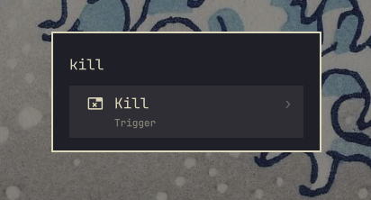
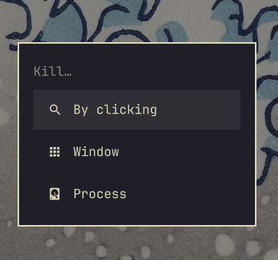
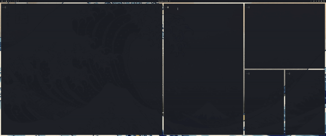

# Omakill

Kill any app or process from the Omarchy menu (`SUPER+SPACE → kill`), or from
the skull button on your bar. Three fast actions, no background daemons:

* **By clicking** — `hyprctl kill` xkill-style with a hint toast
* **Window** — pick an open window from the native menu
  (shows class/title + workspace/PID, no raw addresses)
* **Process** — pick a process with **live** CPU/MEM
  (btop-style `/proc` sampling, top-200 by memory, TERM→KILL escalation,
  PID 1/self guards, confirm step)





Full-quality video:
[screenrecording-2026-09-03_22-06-08.mp4](https://github.com/Hangovers/omakill/releases/download/v1.0.2/screenrecording-2026-09-03_22-06-08.mp4)

## Install (Trigger menu)

```sh
omarchy plugin add https://github.com/hangovers/omakill.git
~/.config/omarchy/plugins/io.github.hangovers.omakill/install.sh
```

This merges a marked `Trigger › Kill` block into
`~/.config/omarchy/extensions/omarchy-menu.jsonc` (your other entries and
comments are untouched; re-running is safe) and copies the two helper
commands to `~/.local/bin` (existing files are backed up first).
Searching `kill` shows only the `Kill` parent; enter it for the three
actions.

Requirements: Omarchy Quattro, `hyprctl`, `jq` — all stock. No extra
packages, no background services, no elevation required.

## Skull button (optional)

Prefer a bar button over the menu? Either enable the bundled widget:

```sh
omarchy plugin enable io.github.hangovers.omakill --section right
```

or install everything in one go:

```sh
~/.config/omarchy/plugins/io.github.hangovers.omakill/install.sh --with-bar
```

Click the skull for the kill panel, Escape closes it. Remove just the
button with `omarchy plugin disable io.github.hangovers.omakill` — the
Trigger menu keeps working.

## Remove

```sh
~/.config/omarchy/plugins/io.github.hangovers.omakill/uninstall.sh
omarchy plugin remove io.github.hangovers.omakill
```

## How it works

The QML panel is a thin launcher: the bundled helpers in `bin/` do the
real work and summon Omarchy's native menus themselves, so there is no
duplicated picker logic. Removing the plugin leaves nothing behind
(except the optional Trigger block, removed by `./uninstall.sh`).

## License

MIT — see [LICENSE](LICENSE).
